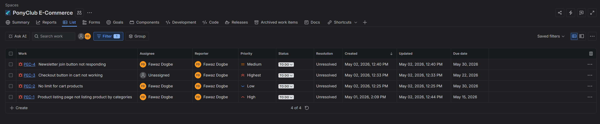
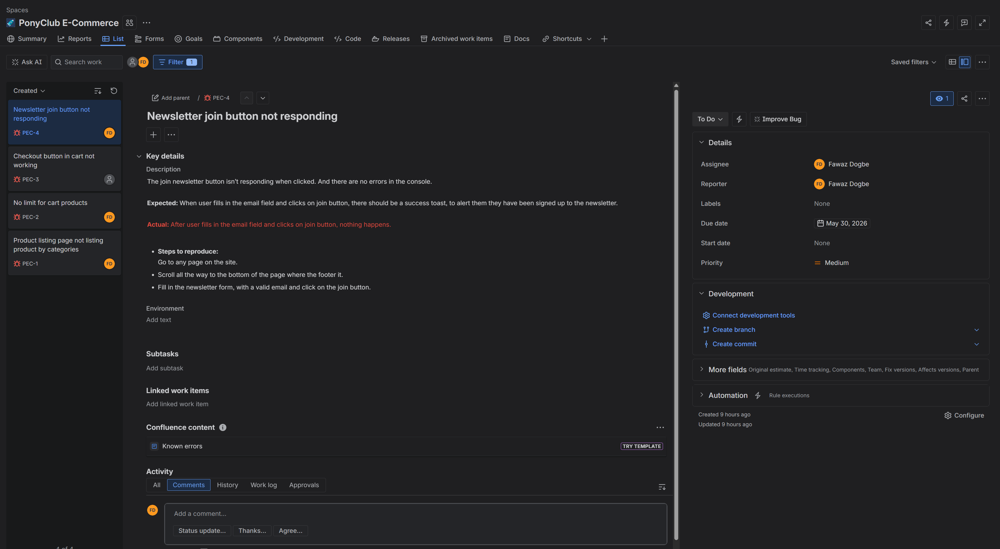
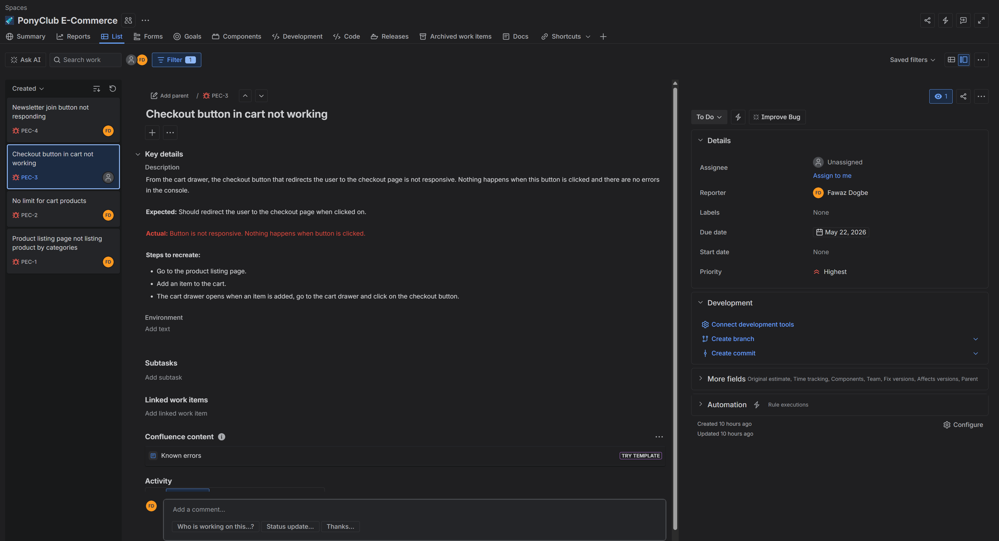

# PBPonyClub QA Testing Project

This project demonstrates end-to-end quality assurance testing for a real-world e-commerce application using manual testing, exploratory testing, regression testing, defect tracking, and automated regression testing.

The goal of this project was to simulate a real QA workflow from test planning to automated test execution.

---

# Application Under Test

**Website:** https://wig-site.vercel.app/

PBPonyClub is an e-commerce platform where users can:

- Browse products
- View product details
- Add products to cart
- Update cart quantity
- Remove products from cart
- Proceed to checkout

---

# Test Plan

Created a detailed test plan document that defined:

- Testing objectives
- Scope
- Testing approach
- Test environment
- Defect management process
- Risks and mitigation strategies
- Test deliverables

### Scope Covered

- Homepage & Navigation  
- Product Catalogue  
- Product Details Page  
- Shopping Cart  
- Checkout Flow  
- Responsive Design  
- Cross-browser Compatibility  

### Testing Approach

- Manual Testing  
- Exploratory Testing  
- Regression Testing  
- Automated Testing  

**Test Plan Document:** [https://docs.google.com/document/d/1lKH0tSV_jaL0ZKhQYD_MvDMQxwiaxgav/edit?usp=sharing&ouid=107039629163579905857&rtpof=true&sd=true]

---

# Test Cases

Created structured manual test cases for major user journeys across the application.

### Test Case Fields

- Test Case ID  
- Title  
- Preconditions  
- Steps  
- Test Data  
- Expected Result  
- Actual Result  
- Status  
- Priority  

### Areas Tested

- Homepage navigation  
- Product listing  
- Product details  
- Add to cart  
- Cart updates  
- Remove from cart  
- Checkout flow  
- Responsive testing  
- Cross-browser testing  

**Test Cases Document:** [https://docs.google.com/spreadsheets/d/1O2kE5klGxMMaAgi1L2qAT1lnJqrBy5pGvW9ziX2g-fE/edit?usp=sharing]

---

# Manual Testing Execution

Executed manual test cases against the live application to validate critical user flows.

Manual testing focused on:

- Product browsing functionality  
- Product detail validation  
- Cart operations  
- Checkout functionality  
- Form behavior  
- Navigation flow testing  

---

# Exploratory Testing

Performed exploratory testing to identify edge cases and unexpected user behavior.

Examples included:

- Refreshing checkout flow  
- Testing repeated cart additions  
- Navigating across pages in unexpected sequences  

---

# Regression Testing

Performed regression testing after validating fixes and major workflows to ensure existing functionality remained stable.

Regression coverage included:

- Product listing flow  
- Add to cart flow  
- Cart quantity updates  
- Product removal  
- Checkout navigation  

---

# Defect Tracking

All bugs identified during testing were logged in Jira.

Each bug report included:

- Bug title  
- Steps to reproduce  
- Expected result  
- Actual result  
- Supporting screenshots/videos  
- Severity level  

### Severity Levels Used

- Highest  
- High  
- Medium  
- Low  
- Lowest  

**JIRA Board:** 


## Sample Bug Report

### Newsletter joining bug


### Cart limit bug


---

# Automated Regression Testing

Automated critical regression scenarios.

### Automated Test Coverage

- Verify product listing page loads successfully  
- Validate products display on shop page  
- Add product to cart  
- Increase cart quantity  
- Remove product from cart  
- Validate checkout redirection  

### Run Automation Tests

```bash
npm run cypress:run
```

# Test Execution Summary

The manual test suite was executed against the live application after test case creation.

| Metric | Count |
|---------|---------|
| Total Test Cases | 29 |
| Passed | 22 |
| Failed | 4 |
| Blocked | 3 |
| Bugs Logged | 4 |


---

# Key QA Skills Demonstrated

- Test Planning  
- Manual Testing  
- Exploratory Testing  
- Regression Testing  
- Bug Reporting  
- Jira Workflow  
- Test Documentation  
- Cross-browser Testing  
- Responsive Testing  
- Test Automation (Cypress)  

---

# Project Goal

This project was created to demonstrate practical QA experience by applying structured testing workflows to a live e-commerce application—from test planning and manual execution to defect tracking and automated regression testing.

The project reflects my ability to contribute to QA processes across both manual and automation testing environments.